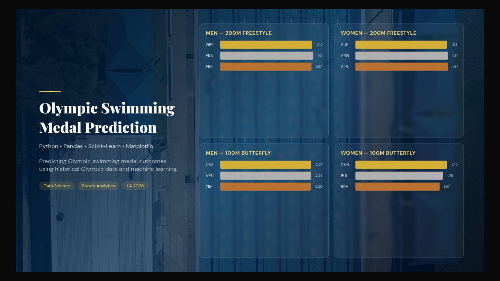

# Olympic Swimming Medal Prediction


<p align="center">
  
</p>

## Project Overview

This project analyzes historical Olympic swimming results (1912–2020) and applies machine learning techniques to predict medal outcomes for the 2028 Olympic Games. The analysis includes data preprocessing, feature engineering, model comparison, performance evaluation, and probability-based medal predictions.

---

## Dataset

The dataset contains historical Olympic swimming competition results from 1912 to 2020. After preprocessing, the final machine learning dataset included 930 observations and the following features:

- Year
- Gender
- Country
- Event
- Medal (Target Variable)

---

## Objectives

- Analyze historical Olympic swimming performance.
- Prepare and preprocess the dataset for machine learning.
- Compare multiple classification algorithms.
- Address class imbalance using class weighting.
- Predict medal probabilities for the 2028 Olympic Games.
- Rank countries based on predicted medal performance.
- Visualize the predicted podium for selected swimming events.

---

## Technologies Used

- Python
- Pandas
- NumPy
- Matplotlib
- Scikit-learn
- Jupyter Notebook

---

## Methodology

The project followed a complete machine learning workflow:

1. Data cleaning and preprocessing.
2. Exploratory Data Analysis (EDA).
3. Feature engineering and label encoding.
4. Model training using:
   - Logistic Regression
   - Decision Tree
   - Random Forest
5. Model evaluation using:
   - Accuracy
   - Classification Report
   - Confusion Matrix
   - Cross Validation
6. Hyperparameter tuning with GridSearchCV.
7. Class balancing using a weighted Random Forest model.
8. Medal probability prediction for the 2028 Olympic Games.
9. Dashboard visualization of predicted podiums.

---

## Key Results

- Random Forest achieved the best overall predictive performance.
- Hyperparameter tuning was performed using GridSearchCV.
- Class balancing improved the treatment of minority medal classes.
- Medal probabilities were generated instead of only class predictions.
- The final model ranked countries according to their predicted medal performance for selected events in the 2028 Olympic Games.

---

## Repository Structure

```
Olympic_Swimming_Medal_Prediction.ipynb
Olympic_Swimming_Medal_Prediction_Report.docx
Data_Collection.csv
olympics_2028_predictions.csv
```

| File | Description |
|------|-------------|
| Olympic_Swimming_Medal_Prediction.ipynb | Complete data analysis and machine learning workflow. |
| Olympic_Swimming_Medal_Prediction_Report.docx | Project report describing methodology and results. |
| Data_Collection.csv | Historical Olympic swimming dataset. |
| olympics_2028_predictions.csv | Predicted medal outcomes generated by the final model. |

---

## Future Improvements

- Train the models using additional athlete performance metrics.
- Incorporate recent international competition results.
- Evaluate ensemble and boosting algorithms such as XGBoost and LightGBM.
- Deploy the prediction model as an interactive web application.

---

## Author

**Guillermo Arturo Mawcinitt Carriles**

Data Analytics | Machine Learning | Python

- GitHub: https://github.com/Mawcinitt777
- LinkedIn: https://www.linkedin.com/in/guillermo-mawcinitt/
